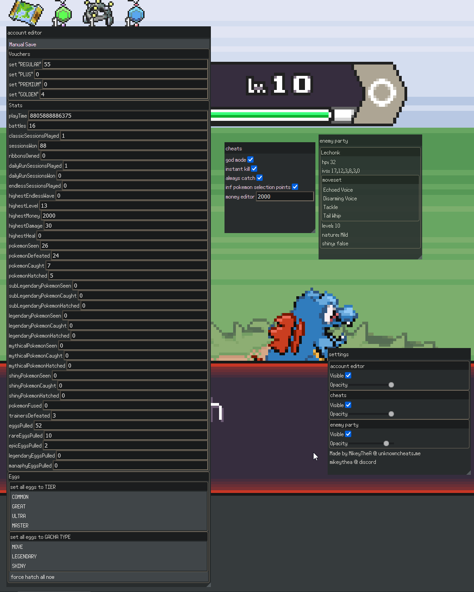

cool stuff
https://www.unknowncheats.me/forum/other-games/636038-pokerogue-net-extension-menu.html

tested on edge and firefox
load as unpacked on chromium and select the folder with the contents
on firefox go on about:debugging -> this firefox -> load temporary add-on and select the manifest [in the extension folder after building]
for firefox you may need to go to extensions and right click on it and enable always allow on pokerogue.net although it only sometimes needs this
```
current features:
  account editor
    manually saving (no need to do a battle to save)
    voucher count editing (give yourself vouchers)
    editing all of your stats seen in the stats screen and more
    editing the TIER of all your eggs (COMMON, GREAT, ULTRA, MASTER etc)
    editing the GACHA TYPE of all your eggs (MOVE, LEGENDARY, SHINY, etc these just change your chances of getting something from a egg or something)
    no egg wave requirement (no need to do many waves to hatch eggs)
  ingame cheats
    god mode (your pokemon take 0 damage)
    instant kill (your pokemon deal the same amount of damage as the enemy has health)
    always catch (makes your pokeballs have a guaranteed catch, and usually(doesn't on trainers, as it would break the game) always lets you throw a pokeball)
    inf pokemon selection points (no point limit on pokemon selection when making a new game)
    money editor (change your money in your run)
  enemy party
    see info about the enemy party
      hp (health points)
      ivs (i dont know what order these are in, i don't even know what any of this means (what the fuck is a pokemon))
      moveset
      level
      nature
      shiny status
  update checker
```

to build
1. you need node (& npm)
2. `npm install`
3. `./build.sh` (if on windows just `npm run build` then move the file dist/assets/index-(some random shit).js file to the extension folder as `index`)
4. check the `extension` folder

pull requests are welcome, the code is an absolute mess!



<details>
<summary>balooney from the original repo</summary>
<picture></picture>

PokéRogue is a browser based Pokémon fangame heavily inspired by the roguelite genre. Battle endlessly while gathering stacking items, exploring many different biomes, fighting trainers, bosses, and more! 

# Contributing
## 🛠️ Development
If you have the motivation and experience with Typescript/Javascript (or are willing to learn) please feel free to fork the repository and make pull requests with contributions. If you don't know what to work on but want to help, reference the below **To-Do** section or the **#feature-vote** channel in the discord. 

### 💻 Environment Setup
#### Prerequisites
- node: 20.13.1
- npm: [how to install](https://docs.npmjs.com/downloading-and-installing-node-js-and-npm)

#### Running Locally
1. Clone the repo and in the root directory run `npm install`
    - *if you run into any errors, reach out in the **#dev-corner** channel in discord*
2. Run `npm run start:dev` to locally run the project in `localhost:8000`

#### Linting
We're using ESLint as our common linter and formatter. It will run automatically during the pre-commit hook but if you would like to manually run it, use the `npm run eslint` script. 

### ❔ FAQ 

**How do I test a new _______?**
- In the `src/overrides.ts` file there are overrides for most values you'll need to change for testing


## 🪧 To Do
Check out [Github Issues](https://github.com/pagefaultgames/pokerogue/issues) to see how can you help us!

# 📝 Credits
> If this project contains assets you have produced and you do not see your name here, **please** reach out.

### 🎵 BGM
  - Pokémon Mystery Dungeon: Explorers of Sky
    - Arata Iiyoshi
    - Hideki Sakamoto
    - Keisuke Ito
    - Ken-ichi Saito
    - Yoshihiro Maeda
  - Pokémon Black/White
    - Go Ichinose
    - Hitomi Sato
    - Shota Kageyama
  - Pokémon Mystery Dungeon: Rescue Team DX
    - Keisuke Ito
    - Arata Iiyoshi
    - Atsuhiro Ishizuna
  - Pokémon HeartGold/SoulSilver
  - Pokémon Black/White 2
  - Pokémon X/Y
  - Pokémon Omega Ruby/Alpha Sapphire
  - Pokémon Sun/Moon
  - Pokémon Ultra Sun/Ultra Moon
  - Pokémon Sword/Shield
  - Pokémon Scarlet/Violet
  - Firel (Custom Metropolis and Laboratory biome music)
  - Lmz (Custom Jungle biome music)

### 🎵 Sound Effects
  - Pokémon Emerald
  - Pokémon Black/White

### 🎨 Backgrounds
  - Squip (Paid Commissions)
  - Contributions by Someonealive-QN

### 🎨 UI
  - GAMEFREAK
  - LJ Birdman

### 🎨 Pagefault Games Intro
  - Spectremint

### 🎨 Game Logo
  - Gonstar (Paid Commission)

### 🎨 Trainer Sprites
  - GAMEFREAK (Pokémon Black/White 2, Pokémon Diamond/Pearl)
  - kyledove
  - Brumirage
  - pkmn_realidea (Paid Commissions)

### 🎨 Trainer Portraits
  - pkmn_realidea (Paid Commissions)

### 🎨 Pokemon Sprites and Animation
  - GAMEFREAK (Pokémon Black/White 2)
  - Smogon Sprite Project (Various Artists)
  - Skyflyer
  - Nolo33
  - Ebaru
  - EricLostie
  - KingOfThe-X-Roads
  - kiriaura
  - Caruban
  - Sopita_Yorita
  - Azrita
  - AshnixsLaw
  - Hellfire0raptor
  - RetroNC
  - Franark122k
  - OldSoulja
  - PKMarioG
  - ItsYugen
  - lucasomi
  - Pkm Sinfonia
  - Poki Papillon
  - Fleimer_
  - bizcoeindoloro
  - mangalos810
  - Involuntary-Twitch
  - selstar

### 🎨 Move Animations
  - Pokémon Reborn

</details>